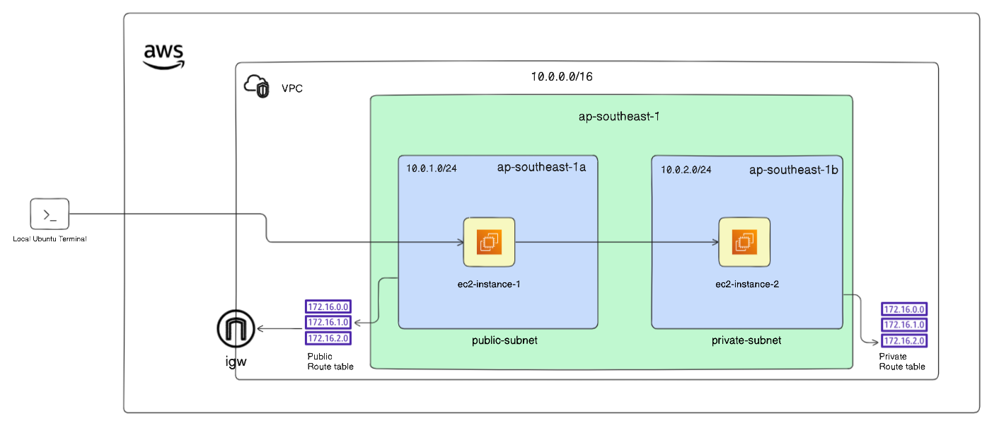
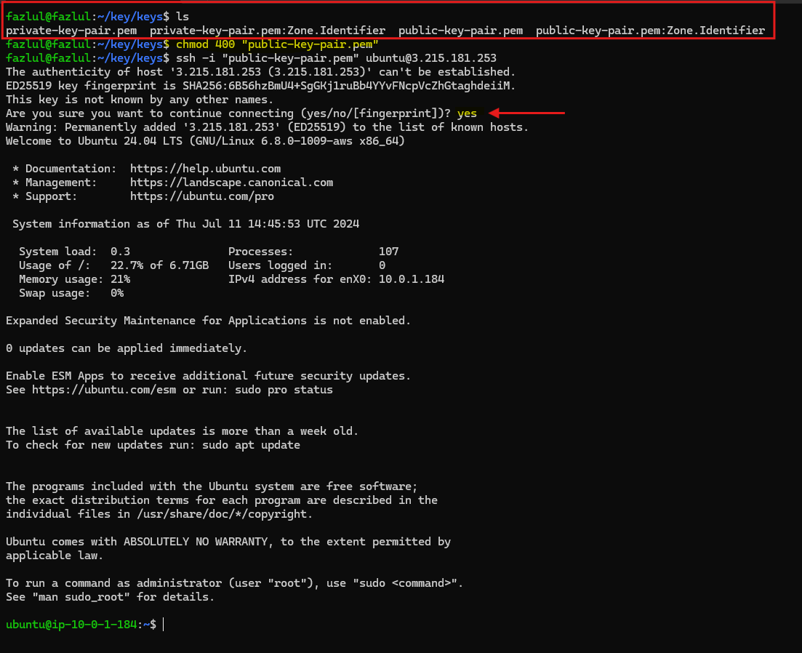

# Creating and Configuring a Secure AWS VPC with Public and Private Subnets

This document guides you through the process of creating a Virtual Private Cloud (VPC) and associated resources within AWS. A VPC allows you to launch AWS resources into a virtual network that you have complete control over. By the end of this guide, you will have created a VPC with public and private subnets, route tables, an internet gateway, security groups, and EC2 instances. Additionally, you'll learn how to SSH into the public EC2 instance from your local machine and from the public EC2 instance to the private EC2 instance.

**Objectives**

Create a VPC.

Create a Public and Private Subnet.

Create Routes and an Internet Gateway.

Launch EC2 instances in the Subnets.

Add a Security Group.

SSH into the Public EC2 Instance.

SSH from the Public EC2 Instance to the Private EC2 Instance

**1. Create a VPC**

A Virtual Private Cloud (VPC) provides an isolated network environment in AWS, enabling you to launch AWS resources in a virtual network that you define.

Navigate to the VPC Console:

Log into the AWS Management Console.

In the Services menu, select "VPC" or search for "VPC".

Create the VPC:

Click on "Create VPC".

Set the following values:

VPC Name: my-vpc

IPv4 CIDR block: 10.0.0.0/16

IPv6 CIDR block: No IPv6 CIDR block

Tenancy: Default Tenancy

Click "Create VPC".

**2. Create Subnets**

Subnets allow you to partition your VPC's IP address range into smaller segments, enabling better management of resources within different availability zones.

Navigate to Subnets:

In the left-hand menu, click on "Subnets".

Click on "Create subnet".

Create the Public Subnet:

VPC ID: Select the VPC ID for my-vpc.

Subnet Name: public-subnet

Availability Zone: ap-southeast-1a

IPv4 CIDR block: 10.0.1.0/24

Click "Create Subnet".

Create the Private Subnet:

Click "Add new subnet".

Subnet Name: private-subnet

Availability Zone: ap-southeast-1b

IPv4 CIDR block: 10.0.2.0/24

Click "Create Subnet".

**3. Create an Internet Gateway**

An Internet Gateway allows instances in the VPC to communicate with the internet. It serves as a target for the VPC route tables for internet-routable traffic.

Navigate to Internet Gateways:

In the left-hand menu, select "Internet Gateways".

Click on "Create internet gateway".

Create the Internet Gateway:

Name tag: my-IGW

Click "Create internet gateway".

Attach the Internet Gateway to the VPC:

Select the newly created internet gateway.

Click "Actions" > "Attach to VPC".

Select my-vpc.

Click "Attach internet gateway".

**4. Create Route Tables**

Route tables control the routing of network traffic within your VPC. Public route tables direct traffic to the Internet Gateway, while private route tables handle internal routing.

Navigate to Route Tables:

In the left-hand menu, select "Route Tables".

Click on "Create route table".

Create the Public Route Table:

Name: public-route-table

VPC: Select my-vpc.

Click "Create route table".

Add Route to the Internet Gateway:

Select the public-route-table.

In the "Routes" tab, click "Edit routes".

Click "Add route".

Destination: 0.0.0.0/0

Target: Select the internet gateway my-IGW.

Click "Save changes".

Associate Public Route Table with Public Subnet:

In the "Subnet associations" tab, click "Edit subnet associations".

Select public-subnet.

Click "Save associations".

Create the Private Route Table:

Click "Create route table".

Name: private-route-table

VPC: Select my-vpc.

Click "Create route table".

Associate Private Route Table with Private Subnet:

Select the private-route-table.

In the "Subnet associations" tab, click "Edit subnet associations".

Select private-subnet.

Click "Save associations".

**5. Create Security Group**

Security groups act as a virtual firewall for your EC2 instances to control inbound and outbound traffic. They are essential for defining and enforcing network access rules.

Navigate to Security Groups:

In the left-hand menu, select "Security Groups".

Click on "Create security group".

Create the Security Group:

Security group name: security-group-1

Description: Allow SSH and all outbound traffic

VPC: Select my-vpc

Configure Inbound Rules:

In "Inbound rules" section click on Add rule>

Type: SSH

Source: Anywhere (0.0.0.0/0)

Configure Outbound Rules:

In "Outbound rules" section click on Add rule>

Type: All traffic

Destination: Anywhere (0.0.0.0/0)

Verify Resources:

In the left-hand menu, select "VPC".

View the resources map of our vpc (my-vpc)

**6. Launch EC2 Instances**

EC2 instances are virtual servers in the cloud, providing scalable computing capacity. Launching instances in public and private subnets allows you to control access and network traffic.

Launch Public EC2 Instance:

Navigate to "EC2" in the Services menu.

Click on "Instances" > "Launch instances".

Name: ec2-instance-1

Application and OS Images (Amazon Machine Image): Select "Ubuntu Server 24.04 LTS".

Instance Type: Select t2.micro.

Key pair (login): Click "Create new key pair".

Key pair name: public-key-pair

Key pair type: RSA

Private key file format: .pem or .ppk

Click "Create key pair".

Note : Download and save the key in your desired directroy,we will need it later

Network settings: Click "Edit".

VPC: Select my-vpc.

Subnet: Select public-subnet.

Auto-assign Public IP: Enable.

Security group: Select security-group-1.

Click "Launch instance".

Launch Private EC2 Instance:

Navigate back to "Instances" > "Launch instances".

Name: ec2-instance-2

Application and OS Images (Amazon Machine Image): Select "Ubuntu Server 24.04 LTS".

Instance Type: Select t3.micro.

Key pair (login): Click "Create new key pair".

Key pair name: private-key-pair

Key pair type: RSA

Private key file format: .pem or .ppk

Click "Create key pair".

Note : Download and save the key in your desired directroy,we will need it later

Network settings: Click "Edit".

VPC: Select my-vpc.

Subnet: Select private-subnet.

Auto-assign Public IP: Disable.

Security group: Select security-group-1.

Click "Launch instance".

**7. SSH into the Public EC2 Instance**

SSH (Secure Shell) allows you to securely access your EC2 instances. We'll first connect to the public instance from your local machine.

Set Permissions on the Key Pair:

Open your terminal.

Navigate to the directory containing your public-key-pair.pem file.

Run the following command to set the correct permissions: chmod 400 "public-key-pair.pem"

Connect to the Public EC2 Instance:

Obtain the public IP address of ec2-instance-1 from the EC2 console.

Run the following command to connect to the instance (replace <ec2-instance-1-public-IP> with your instance's public IP address): ssh -i "public-key-pair.pem" ubuntu@<ec2-instance-1-public-IP>

**8. SSH from the Public EC2 Instance to the Private EC2 Instance**

To access the private EC2 instance, we'll SSH from the public instance using the private key of the private instance.

Copy the content of public key from the directory containing private-key-pair.pem file :

Create the Private Key File on the Public Instance:

Once connected to ec2-instance-1, create a file for the private key with nano or vim (text editor) in ec2-instance-1: nano private-key-pair.pem Paste the contents of your private-key-pair.pem file.

Set Permissions on the Private Key File:

Run the following command to set the correct permissions: chmod 400 private-key-pair.pem

Connect to the Private EC2 Instance:

Obtain the private IP address of ec2-instance-2 from the EC2 console.

Run the following command to connect to the instance (replace <ec2-instance-2-public-IP> with your instance's private IP address): ssh -i "private-key-pair.pem" ubuntu@<ec2-instance-2-public-IP>

You have now successfully created a VPC, subnets, internet gateway, route tables, security group, launched EC2 instances, and established SSH connections to both the public and private instances.

