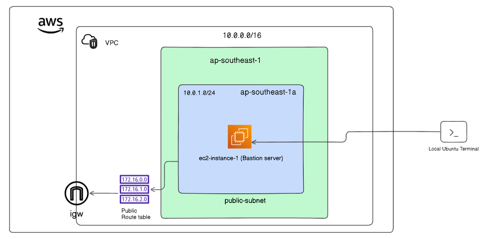

# Deploying a Bastion Server in a Public Subnet

VPC allows users to create a private network within AWS, isolating and protecting resources. Within this VPC, a crucial security component is the bastion server. This server acts as a gateway, enabling secure access to resources in the private VPC environment from the internet. In this lab, we will deploy a bastion server in a public subnet.

**What is a Bastion Server?**
A bastion server is an EC2 instance that acts as a secure gateway for accessing private instances within an AWS VPC environment. Also known as a jump server, it provides a controlled access point from the internet into the private network.

A bastion server runs on an Ubuntu EC2 instance hosted in a public subnet of an AWS VPC. This instance is configured with a security group that allows SSH access from anywhere over the internet. The bastion server facilitates secure connections to instances within private subnets, ensuring that these instances remain inaccessible directly from the internet, thereby enhancing the overall security of the VPC.

**Objectives**

Create a VPC.

Create a Public Subnet.

Create Routes and an Internet Gateway.

Launch EC2 instances in the Public Subnets.

Add a Security Group.

SSH into the Public EC2 Instance.

